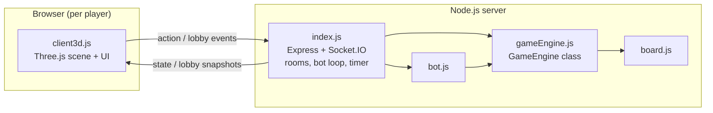

# 🛠️ Hexion — Technical Documentation

Technical reference for the **Hexion** 3D game: the tech stack, project structure, runtime architecture, network protocol, and the authoritative game engine. For setup and how-to-play, see [README.md](README.md).

Hexion ships as two sibling apps that **share the exact same server-side game engine**; only the front-end rendering differs:

| App | Folder | Rendering | Default port |
| --- | --- | --- | --- |
| Hexion (3D) | `Hexion/` | Three.js (WebGL) | `3001` |
| Hexion 2D | `Hexion2D/` | HTML5 Canvas 2D | `3000` |

Because both servers run on different ports, you can host the 2D and 3D versions at the same time on one machine.

## Tech stack

### Runtime and language

- **Node.js** — server runtime.
- **CommonJS** modules (`"type": "commonjs"`).
- **Vanilla JavaScript** everywhere — no transpiler, no bundler, **no build step**. Source files are served as-is.

### Server dependencies

Declared in [package.json](package.json):

| Package | Version | Purpose |
| --- | --- | --- |
| `express` | `^4.19.2` | HTTP server + static file hosting for the `public/` folder. |
| `socket.io` | `^4.7.5` | Real-time, bidirectional WebSocket channel for lobby and gameplay events. |

### Client dependencies (browser, via CDN)

Loaded directly in [public/index.html](public/index.html) — no npm install needed on the client:

| Library | Version | Source | Purpose |
| --- | --- | --- | --- |
| Socket.IO client | matches server | `/socket.io/socket.io.js` (served by the server) | Talks to the game server. |
| Three.js | r128 | cdnjs | WebGL 3D scene, meshes, lighting, materials. |
| OrbitControls | 0.128.0 | jsDelivr | Orbit / zoom / pan camera control. |

The 2D app (`Hexion2D`) uses only the Socket.IO client plus the native Canvas 2D API — no Three.js.

## Project structure

```text
Hexion/
├── package.json          # name, scripts, server dependencies
├── README.md             # setup + how to play
├── TECHNICAL.md          # this document
├── server/               # Node.js authoritative back end
│   ├── index.js          # Express + Socket.IO server: rooms, lobby, bot loop, turn timer
│   ├── gameEngine.js     # GameEngine class — authoritative rules (shared with Hexion2D)
│   ├── board.js          # Procedural board geometry (hexes, vertices, edges, ports)
│   └── bot.js            # Heuristic AI for empty seats
└── public/               # browser front end (served statically)
    ├── index.html        # lobby + game DOM, loads Three.js + OrbitControls via CDN
    ├── style.css         # all UI styling
    └── client3d.js       # Three.js scene, rendering, input, minimap, socket client
```

### Module sizes (approximate)

| File | Lines | Role |
| --- | --- | --- |
| `public/client3d.js` | ~3300 | Largest module: 3D scene, terrain, animations, UI, networking. |
| `server/gameEngine.js` | ~640 | Authoritative rules engine. |
| `public/style.css` | ~625 | UI styling. |
| `server/index.js` | ~320 | Server, rooms, sockets, bot loop, timer. |
| `server/bot.js` | ~200 | Bot decision logic. |
| `public/index.html` | ~185 | Lobby + game markup. |
| `server/board.js` | ~170 | Board generation. |

## Architecture overview

The server is **authoritative**: all game logic and validation live in `GameEngine`. Clients are thin — they render the state they receive and send intent (actions) back. This prevents cheating and keeps every player consistent.



### Request / data flow

1. A browser loads `index.html` from Express and opens a Socket.IO connection.
2. The host emits `createRoom`; the server creates a room with a 4-letter code and a preview board.
3. Other players emit `joinRoom` with that code. The host can add bots and set a turn timer.
4. On `startGame`, the server instantiates a `GameEngine` for the room and broadcasts `gameStarted`.
5. During play, clients emit `action` messages (e.g. roll, build, trade). The engine validates and mutates state.
6. After every action the server sends each human a personalized `state` snapshot (private info such as another player's hand is hidden).
7. Bots are driven server-side by a loop that calls `botStep` on the engine.

## Server modules

### `index.js` — transport, rooms, orchestration

- Creates the Express app, serves `public/`, and attaches a Socket.IO server.
- Listens on `process.env.PORT || 3001`, bound to `0.0.0.0` so LAN clients can connect.
- Holds an in-memory `rooms` map: `code -> { players, engine, started, previewBoard, turnSeconds, timer, ... }`.
- Prefers the real Wi-Fi/Ethernet adapter when advertising the LAN URL (virtual adapters such as Hyper-V / WSL / VPN are ranked last), so invite links are reachable.
- Runs the per-turn timer and the bot loop.

State is **in-memory only** — there is no database. Stopping the server clears all rooms.

#### Socket events: client to server

| Event | Payload | Description |
| --- | --- | --- |
| `createRoom` | `{ name }` | Create a room; returns the room code. |
| `joinRoom` | `{ name, code }` | Join an existing room. |
| `addBot` | — | Host adds a bot to an empty seat. |
| `removeBot` | `{ id }` | Host removes a bot. |
| `randomizeMap` | — | Host re-rolls the preview board. |
| `setTimer` | `{ seconds }` | Host sets the per-turn timer (0 = off). |
| `startGame` | — | Host starts the game (2–4 players). |
| `action` | `{ type, payload }` | A gameplay action (see below). |
| `leaveRoom` | — | Leave the current room. |
| `disconnect` | — | Connection dropped (seat kept for reconnection mid-game). |

#### Socket events: server to client

| Event | Description |
| --- | --- |
| `lobby` | Lobby snapshot: players, host, timer setting, preview board, LAN URL. |
| `gameStarted` | Signals the transition from lobby to game. |
| `state` | Per-player game state snapshot (private data hidden). |

#### Gameplay `action` types

Routed by `index.js` to the matching `GameEngine` method:

`rollDice`, `build`, `buyDev`, `playDev`, `bankTrade`, `proposeTrade`, `respondTrade`, `confirmTrade`, `cancelTrade`, `discard`, `moveRobber`, `endTurn`.

### `gameEngine.js` — authoritative rules

Exports `{ GameEngine, RESOURCES, COSTS }`.

- `RESOURCES`: `brick`, `lumber`, `wool`, `grain`, `ore`.
- Game **phases**: `setup1` → `setup2` → `play` → `over`.
- Setup uses snake order (forward then reverse) so each player places two settlements and two roads.
- Tracks players, hands, buildings (settlements, cities, roads), the robber, the development-card deck, and the bonus holders.
- **Longest Road** requires a road run greater than 4; **Largest Army** requires more than 2 played knights.
- First player to reach the victory-point target wins; the engine sets phase to `over`.
- `getState(playerIdx)` returns a snapshot tailored to one player so opponents' private information is not leaked.

Key method groups:

- Placement and validation: `canPlaceSettlement`, `canPlaceRoad`, `placeSetupSettlement`, `placeSetupRoad`, `advanceSetup`.
- Turn cycle: `startTurn`, `rollDice`, `produce`, `endTurn`.
- Robber: `startRobber`, `discard`, `moveRobber`, `stealRandom`.
- Building and economy: `build`, `buyDev`, `playDev`, `bankTrade`, and player-to-player trade methods.

### `board.js` — procedural board

- Exports `{ generateBoard, HEX_SIZE }`.
- Builds the classic 3-4-5-4-3 island (19 hexes) with standard resource counts.
- Produces a normalized graph the engine and both renderers share:
  - **hexes** — resource, number token, center, corner vertex ids.
  - **vertices** — settlement/city build spots (shared between adjacent hexes).
  - **edges** — road build spots.
  - **ports** — trade ratios (3:1 and 2:1) anchored to coastal vertices.
- `randomizeMap` regenerates this structure for the lobby preview.

### `bot.js` — heuristic AI

- Exports `{ botStep }`, called once per bot decision point by the server loop.
- Scores vertices by production value, picks settlement spots, extends roads toward expansion, manages resource surplus/deficit for trades and builds, and resolves robber/discard steps.
- Bots run entirely server-side through the same `GameEngine` API as human actions.

## Client (`public/client3d.js`)

Single-file front end with no framework. Major responsibilities:

- **Lobby UI** — create/join, room code, invite link (LAN URL with `?code=` for one-click join and auto-join), bots, timer, map preview.
- **Three.js scene** — extruded hex prisms, number tokens stuck to tiles, ports as boats, terrain props (forests, herds, mountains, brickworks, desert), water with animated waves, day/night lighting, drifting clouds, and decorative islands.
- **Camera** — `OrbitControls` (left-drag orbit, wheel zoom, right-drag pan) plus a reset button.
- **Input** — raycasting against per-vertex and per-edge markers for placing settlements, cities, and roads.
- **Minimap** — a 2D top-down board (bottom-right) that rotates in sync with the camera so numbers stay readable even when 3D props obscure them.
- **Graphics quality toggle** — `Simple` (smooth) vs `✨ Extreme` (shadows, dense props, hi-res rendering).
- **Networking** — Socket.IO client that emits actions and renders incoming `state` snapshots.

Client preferences (player name, night mode, graphics quality) persist in `localStorage` under `hexion*` keys.

## Networking and connectivity

- The server binds to `0.0.0.0:<PORT>` so friends on the same Wi-Fi/LAN can reach it via the host's LAN IP.
- The advertised network URL and invite link prefer the physical Wi-Fi/Ethernet adapter over virtual adapters.
- For play across different networks, tunnel the local port with Cloudflare Tunnel or ngrok (see [README.md](README.md)).
- Windows Firewall must allow inbound Node.js on the active network profile.

## Running locally

```powershell
npm install
npm start          # node server/index.js  ->  http://localhost:3001
```

For auto-restart on file changes during development:

```powershell
npm run dev        # node --watch server/index.js
```

There is no build or test script; the server serves the `public/` files directly.

## Design notes

- **Authoritative server, thin clients** — all rules live in `GameEngine`; clients never decide outcomes.
- **Shared engine** — `server/` is identical in spirit between Hexion and Hexion2D, so rule changes apply to both; only rendering differs.
- **No build pipeline** — plain CommonJS on the server and plain ES in the browser keep the project easy to run and hack on.
- **In-memory state** — simple and fast for local/LAN sessions; not designed for persistence or horizontal scaling.
